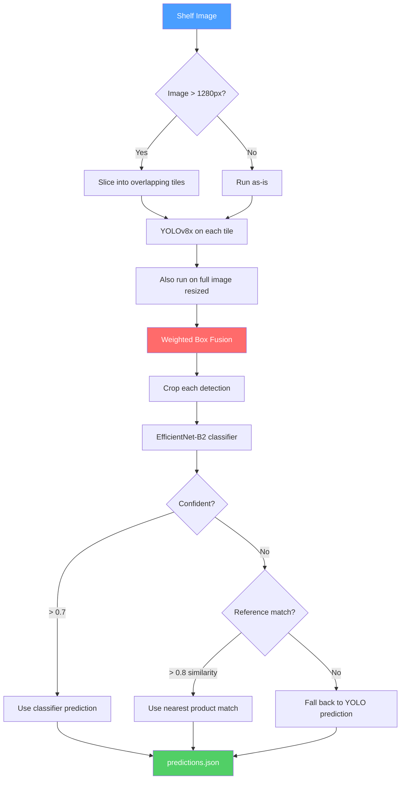

# NorgesGruppen Shelf Detective

Grocery product detection for the [NM i AI 2026](https://ainm.no) competition. Given a photo of a store shelf, find every product and figure out what it is.

The tricky part? There are 356 different products, some with as few as *one* training example. A cereal box that only shows up once in the dataset still needs to be recognized.

## How it works

We use a two-stage approach — first find the products, then figure out what they are.



**Stage 1 — Detection:** A YOLOv8x model scans the shelf image. Since shelf photos can be huge (up to 5712px wide), we slice them into overlapping 1280px tiles so small products don't get lost. Detections from all tiles get merged using Weighted Box Fusion.

**Stage 2 — Classification:** Each detected product gets cropped and run through an EfficientNet-B2 classifier. For rare products the classifier hasn't seen enough of, we compare the crop's embedding against pre-computed reference embeddings from product catalog photos (7 angles per product). If nothing's confident enough, we just go with whatever YOLO thought it was.

## Why two stages?

The dataset is brutally long-tailed. The most common product has 422 annotations, but 74 products have fewer than 5. YOLO alone can *find* products just fine, but it can't reliably tell apart a product it's only seen once. The second stage brings in product reference photos — clean, multi-angle shots of each product — to handle the tail.

## Score breakdown

The competition scores on a weighted formula:

```
Score = 0.7 × detection_mAP + 0.3 × classification_mAP
```

Detection alone (just finding boxes, ignoring what they are) can get you up to 0.70. Correct product identification adds up to 0.30 more. Our two-stage approach targets both.

## Project structure

```
├── training/                  # Runs on GCP GPU VMs
│   ├── train_yolo.py          # YOLOv8x fine-tuning (imgsz=1280, 150 epochs)
│   ├── train_classifier.py    # EfficientNet-B2 on product crops
│   ├── prepare_yolo_dataset.py
│   ├── prepare_crops.py
│   ├── build_reference_embeddings.py
│   └── export_models.py       # ONNX FP16 export
├── submission/                # What gets zipped and uploaded
│   ├── run.py                 # Entry point
│   └── utils.py               # Tiling, WBF, classification logic
├── scripts/
│   ├── evaluate_local.py      # Local scoring (pycocotools)
│   ├── setup_gcp_vm.sh        # Spin up a training VM
│   ├── upload_data.sh         # Push data to the VM
│   └── build_submission.sh    # Package & validate the zip
└── tests/                     # 21 tests
```

## Training data

| What | Size |
|---|---|
| Shelf images | 248 (from Egg, Frokost, Knekkebrod, Varmedrikker sections) |
| Annotations | 22,731 bounding boxes |
| Product categories | 356 (plus `unknown_product`) |
| Products per image | 92 avg, up to 235 |
| Product reference photos | 327 products × ~5 angles each |
| Image resolution | 481px to 5712px wide |

## Quickstart

**Prepare data locally:**
```bash
python3 -m training.prepare_yolo_dataset   # COCO → YOLO format
python3 -m training.prepare_crops          # Extract classifier training crops
```

**Train on GCP:**
```bash
bash scripts/setup_gcp_vm.sh               # Provision L4 GPU VM
bash scripts/upload_data.sh                 # Upload everything
# Then on the VM:
python3 -m training.train_yolo --epochs 150 --batch 4
python3 -m training.train_classifier --epochs 50 --batch 64
python3 -m training.build_reference_embeddings --model-weights runs/classifier/efficientnet_b2_shelf/best.pt --class-mapping runs/classifier/efficientnet_b2_shelf/class_mapping.json
python3 -m training.export_models --yolo-weights runs/detect/yolov8x_shelf/weights/best.pt --clf-weights runs/classifier/efficientnet_b2_shelf/best.pt
```

**Evaluate & submit:**
```bash
python3 -m scripts.evaluate_local --predictions predictions.json --ground-truth data/coco_dataset/train/annotations.json
bash scripts/build_submission.sh            # Validates & zips
```

## Sandbox constraints

The submission runs in a locked-down Docker container:

- **GPU:** NVIDIA L4 (24 GB VRAM)
- **RAM:** 8 GB
- **Timeout:** 300 seconds
- **Network:** None — fully offline
- **Blocked imports:** `os`, `sys`, `subprocess`, `pickle`, `yaml`, `threading`, and more
- **Weight limit:** 420 MB across max 3 files

We use ONNX for both models (avoids pickle dependency) and `pathlib` everywhere instead of `os`.

## Tech stack

| Component | Version | Why |
|---|---|---|
| ultralytics | 8.1.0 | YOLOv8x — pinned to match sandbox |
| timm | 0.9.12 | EfficientNet-B2 — pinned to match sandbox |
| onnxruntime-gpu | 1.20.0 | Fast ONNX inference with CUDA |
| ensemble-boxes | 1.0.9 | Weighted Box Fusion for merging tile detections |
| pycocotools | 2.0.7 | mAP evaluation |

## Competition

Part of [NM i AI 2026](https://ainm.no) — the Norwegian AI Championship. This is the NorgesGruppen Data challenge (object detection track).
