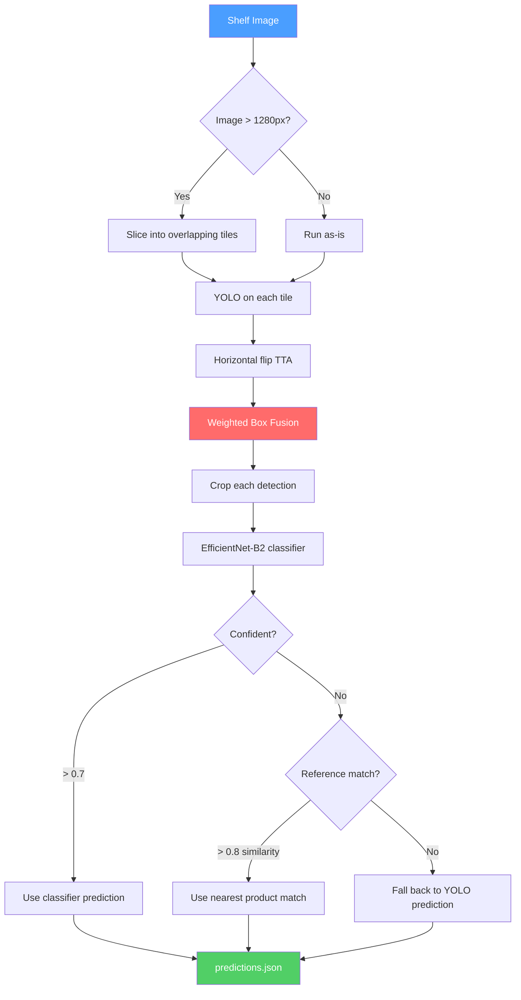

# NorgesGruppen Shelf Detective

Grocery product detection and classification for the [NM i AI 2026](https://ainm.no) (Norwegian National Championship in AI). Given a photo of a store shelf, detect and identify every product — across 356 categories with a heavily long-tailed distribution.

## Highlights

- **Two-stage detection + classification pipeline** — YOLO handles localization while EfficientNet-B2 handles fine-grained product identification, purpose-built for the long-tailed distribution (74 products with fewer than 5 training examples)
- **Tiled inference for high-resolution images** — 1280px overlapping tiles with Weighted Box Fusion handle shelf images up to 5712px wide without downscaling
- **Reference embedding fallback** — cosine similarity matching against product catalog photos catches low-confidence predictions that the classifier misses
- **Sandbox-compliant architecture** — all models exported to ONNX FP16 to work within strict constraints (no pickle, no network, 420 MB weight limit, 300s timeout)
- **Systematic model exploration** — trained and evaluated YOLO11x, YOLOv9e, and YOLOv8x variants across multiple resolutions on parallel GCP GPU VMs

## How it works

Two-stage pipeline — first find the products, then classify them.



**Stage 1 — Detection:** YOLO detects products using tiled inference (1280px tiles, 20% overlap) to handle huge shelf images (up to 5712px). Horizontal flip TTA doubles detections, and Weighted Box Fusion merges everything. The pipeline auto-discovers all `yolo_*.onnx` files in the submission, so multiple YOLO models can ensemble together.

**Stage 2 — Classification:** Each detected product gets cropped, resized to 224px, and run through an EfficientNet-B2 classifier (90.5% val accuracy). For low-confidence predictions, reference embeddings from product catalog photos provide a cosine-similarity fallback. If neither is confident, the YOLO class prediction is used as-is.

## Experiments and iteration

Systematic exploration of detection architectures, training strategies, and data augmentation techniques:

| Approach | mAP50 | Takeaway |
|---|---|---|
| YOLOv8x @ 1280px (baseline) | 0.732 | Strong baseline at high resolution |
| **YOLO11x @ 1280px** | **0.738** | **Best single model** — used in final submission |
| YOLOv9e @ 1280px | 0.736 | Competitive alternative, validated architecture choice |
| YOLO11x @ 640px | 0.724 | Resolution matters more than speed for dense shelves |
| Multi-model ensemble (WBF) | 0.708 | Fusion thresholds need per-dataset calibration — single strong model more reliable |
| Full-data training (no holdout) | 0.987* | *Overfitted metric, but maximizes submission performance |
| Pseudo-labeling on test set | 0.721 | Limited unlabeled data made self-training ineffective |
| Copy-paste augmentation | 0.724 | Synthetic placement didn't match real shelf layouts |
| Model soup (checkpoint avg.) | — | Exported but deprioritized for time |
| DINOv2 embeddings | — | Promising features, blocked by ONNX export constraints |

The classifier was the single biggest improvement — identifying and fixing a class mapping bug took accuracy from **0.49% to 90.5%**, directly impacting the 30% classification component of the score.

## Architecture decisions

- **Two-stage over end-to-end**: The dataset is brutally long-tailed (most common product: 422 annotations, 74 products with <5). YOLO finds boxes well but can't classify rare products. The classifier + reference embeddings handle the tail.
- **ONNX for everything**: The sandbox blocks `pickle`, so PyTorch checkpoints can't be loaded directly for YOLO. ONNX also runs faster via `onnxruntime-gpu`.
- **YOLO11/v9 trained with ultralytics 8.4.24**: The sandbox has ultralytics 8.1.0 which doesn't support these architectures, but their ONNX exports work fine — raw tensor math is architecture-agnostic.
- **Baked data**: Reference embeddings and class mappings are embedded directly in `baked_data.py` as base64-encoded numpy arrays (avoids needing extra files that count against the weight limit).

## Project structure

```
├── training/                     # Runs on GCP GPU VMs
│   ├── train_yolo.py             # YOLO fine-tuning (supports v8x/11x/v9e)
│   ├── train_classifier.py       # EfficientNet-B2 with focal loss
│   ├── prepare_yolo_dataset.py   # COCO → YOLO format conversion
│   ├── prepare_crops.py          # Extract product crops for classifier
│   ├── build_reference_embeddings.py  # Compute reference embeddings
│   ├── export_models.py          # ONNX FP16 export
│   └── data_utils.py             # Shared data loading utilities
├── submission/                   # What gets zipped and uploaded
│   ├── run.py                    # Entry point — ensemble + TTA + two-stage
│   ├── utils.py                  # Tiling, WBF, classification logic
│   └── baked_data.py             # Embedded reference embeddings + class mapping
├── scripts/
│   ├── evaluate_local.py         # Local mAP scoring (pycocotools)
│   ├── build_submission.sh       # Package & validate the zip
│   ├── setup_training_vm.sh      # Provision GCP L4 GPU VM
│   ├── upload_data_to_vm.sh      # Push data to VM
│   ├── train_yolo11x_1280.sh     # YOLO11x training config
│   ├── train_yolov9e_1280.sh     # YOLOv9e training config
│   ├── train_yolo11x_640.sh      # YOLO11x 640px config
│   ├── fix_and_retrain_classifier.sh  # Classifier with fixed class mapping
│   ├── dinov2_embeddings.py      # DINOv2 feature extraction
│   ├── pseudo_label.py           # Pseudo-labeling pipeline
│   ├── generate_synthetic_data.py # Copy-paste augmentation
│   ├── model_soup.py             # Checkpoint averaging
│   ├── export_fp16_safe.py       # Safe FP16 ONNX conversion
│   └── prepare_full_dataset.py   # Full-data (no holdout) prep
└── tests/                        # Unit tests
```

## Training data

| What | Size |
|---|---|
| Shelf images | 248 (Egg, Frokost, Knekkebrod, Varmedrikker sections) |
| Annotations | 22,731 bounding boxes |
| Product categories | 356 (plus `unknown_product`) |
| Products per image | 92 avg, up to 235 |
| Product reference photos | 327 products x ~5 angles each |
| Image resolution | 481px to 5712px wide |

## Quickstart

**Prepare data:**
```bash
python3 -m training.prepare_yolo_dataset   # COCO → YOLO format
python3 -m training.prepare_crops          # Extract classifier training crops
```

**Train on GCP:**
```bash
bash scripts/setup_training_vm.sh          # Provision L4 GPU VM
bash scripts/upload_data_to_vm.sh          # Push data to VM

# On the VM:
python3 -m training.train_yolo --model yolo11x.pt --imgsz 1280 --epochs 300 --batch 2
python3 -m training.train_classifier --epochs 100 --batch 64
python3 -m training.build_reference_embeddings \
    --model-weights runs/classifier/best.pt \
    --class-mapping runs/classifier/class_mapping.json
python3 -m training.export_models \
    --yolo-weights runs/detect/best.pt \
    --clf-weights runs/classifier/best.pt
```

**Evaluate & submit:**
```bash
python3 -m scripts.evaluate_local \
    --predictions predictions.json \
    --ground-truth data/coco_dataset/train/annotations.json
bash scripts/build_submission.sh  # Validates size/imports/counts, then zips
```

## Sandbox constraints

The submission runs in a locked-down Docker container:

- **GPU:** NVIDIA L4 (24 GB VRAM)
- **RAM:** 8 GB
- **Timeout:** 300 seconds for the entire test set
- **Network:** None — fully offline
- **Blocked imports:** `os`, `sys`, `subprocess`, `pickle`, `yaml`, `threading`, `multiprocessing`
- **Weight limit:** 420 MB total, max 3 weight files, max 10 Python files

We use ONNX for both models and `pathlib` everywhere instead of `os`.

## Tech stack

| Component | Version | Why |
|---|---|---|
| ultralytics | 8.1.0 (sandbox) / 8.4.24 (training) | YOLO training and export |
| timm | 0.9.12 | EfficientNet-B2 backbone |
| onnxruntime-gpu | 1.20.0 | ONNX inference with CUDA |
| ensemble-boxes | 1.0.9 | Weighted Box Fusion |
| pycocotools | 2.0.7 | mAP evaluation |

## Infrastructure

Training ran on GCP (`europe-north1`) with up to 6 parallel L4 GPU VMs, each running different model variants simultaneously. Unlimited compute budget courtesy of the competition organizers.

## Competition

Part of [NM i AI 2026](https://ainm.no) — the Norwegian National Championship in AI. NorgesGruppen Data challenge (object detection track).
